# 🚀 UniConnect: Your All-in-One University Companion 🌟


 


**Your Gateway to Seamless Campus Life**  
*Connecting Students with Professors, Resources, and Opportunities in One Click!*

---

## 🌟 Table of Contents
- 🎯 [Key Features](#-key-features)
- 🛠️ [Tech Stack](#%EF%B8%8F-tech-stack)
- 🚦 [System Workflow](#-system-workflow)
- 🏛️ [Core Architecture](#-core-architecture)

---

## 🎯 Key Features

### 🔒 **Login Authentication System**
<div align="center">
  
</div>

#### Key Authentication Features:
- **Password Strength Meter**
- **Session Management**

```csharp
// Sample ASP.NET Core Identity Configuration
services.AddIdentity<ApplicationUser, IdentityRole>(options => {
    options.Password.RequireDigit = true;
    options.Password.RequiredLength = 8;
    options.Lockout.MaxFailedAccessAttempts = 5;
})
.AddEntityFrameworkStores<AppDbContext>()
.AddDefaultTokenProviders();
```

### 🗺️ **Campus Map**


- "Where's My Class?" one-tap solution

### 🍔 **Campus Eats**
<div align="center">
  <div style="display: flex; justify-content: space-between; gap: 20px; margin: 15px 0;">
    
    
  </div>
</div>


- Restaurant Menus and Locations

### 📚 **Professor Directory** *(Powered by SQL Server)*


  
- Robust relational database storing professor profiles
- Search with SQL-powered queries

### 🚌 **Transportation**
<div align="center">
  <div style="display: flex; justify-content: space-between; gap: 20px; margin: 15px 0;">
    
    
  </div>
</div>


### 📢 **News / Events Hub**
  


---


## 🛠️ Tech Stack


---

## 🚦 System Workflow

```mermaid
%%{init: {'theme': 'base', 'themeVariables': { 
  'primaryColor': '#F6F6F6',
  'primaryBorderColor': '#2563EB',
  'primaryTextColor': '#1E293B',
  'lineColor': '#2563EB',
  'tertiaryColor': '#BFDBFE',
  'fontFamily': 'Segoe UI'
}}}%%

flowchart TD
    A[📱Student App] --> B{API Gateway}
    B -->|Authentication| C[🔒 Auth Service]
    B -->|Data Requests| D[🎓 Academic Service]
    B -->|Location| E[🗺️ Mapping Service]
    B -->|Events| F[📅 Calendar Service]
    
    C --> G[(📊 SQL Database)]
    D --> G
    E --> H[(🗄️ Spatial DB)]
    F --> I[(⏳ Events Cache)]
    
    style A fill:#BFDBFE,stroke:#2563EB,stroke-width:2px
    style B fill:#F6F6F6,stroke:#2563EB,stroke-width:2px
    style C fill:#FEF3C7,stroke:#D97706
    style D fill:#D1FAE5,stroke#059669
    style E fill#E0E7FF,stroke#4F46E5
    style F fill#FCE7F3,stroke#DB2777

```



## 🏗️ Core Architecture

```mermaid
%%{init: {'theme': 'base', 'themeVariables': {
  'primaryColor': '#F0F9FF',
  'primaryBorderColor': '#1D4ED8',
  'primaryTextColor': '#1E293B',
  'lineColor': '#1D4ED8',
  'tertiaryColor': '#DBEAFE',
  'fontFamily': 'system-ui',
  'clusterBkg': '#EFF6FF'
}}}%%

flowchart TD
    subgraph Client["📱 Client-Side"]
        A[<img src='https://img.icons8.com/3d-fluency/50/phone.png' width='30'/> Web App]
        B[<img src='https://img.icons8.com/3d-fluency/50/mobile-app.png' width='30'/> Mobile]
    end

    subgraph Server["⚙️ ASP.NET API Layer"]
        C[<img src='https://img.icons8.com/3d-fluency/50/api.png' width='30'/> API Gateway]
        D[<img src='https://img.icons8.com/3d-fluency/50/security-shield-green.png' width='30'/> Auth Service]
        E[<img src='https://img.icons8.com/3d-fluency/50/marker.png' width='30'/> Location Service]
    end

    subgraph Data["💾 Data Layer"]
        F[(<img src='https://img.icons8.com/3d-fluency/50/database.png' width='30'/> SQL Server)]
        G[(<img src='https://img.icons8.com/3d-fluency/50/geometric-entities.png' width='30'/> Spatial DB)]
    end

    subgraph Cloud["☁️ Azure Cloud"]
        H[<img src='https://img.icons8.com/color/50/azure-1.png' width='30'/> Functions]
        I[<img src='https://img.icons8.com/3d-fluency/50/cloud-sync.png' width='30'/> Sync Service]
    end

    Client -->|HTTPS/REST| Server
    Server -->|Entity Framework| Data
    Data -->|Cosmos DB| Cloud
    Cloud -->|WebHooks| Client

    style Client fill:#F0F9FF,stroke:#1D4ED8,stroke-width:2px
    style Server fill#EFF6FF,stroke:#1D4ED8,stroke-dasharray:5 5
    style Data fill#F0FDF4,stroke:#16A34A
    style Cloud fill#F0F9FF,stroke:#0284C7
```


